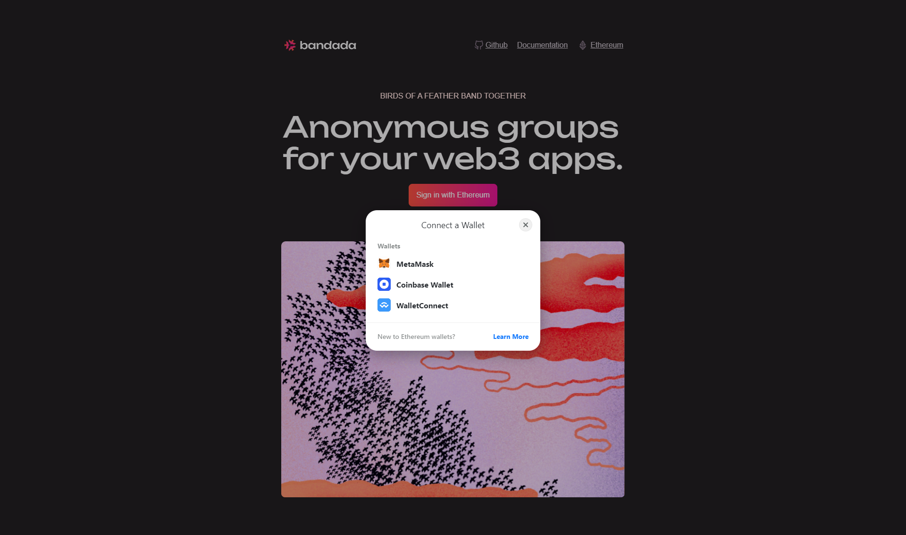
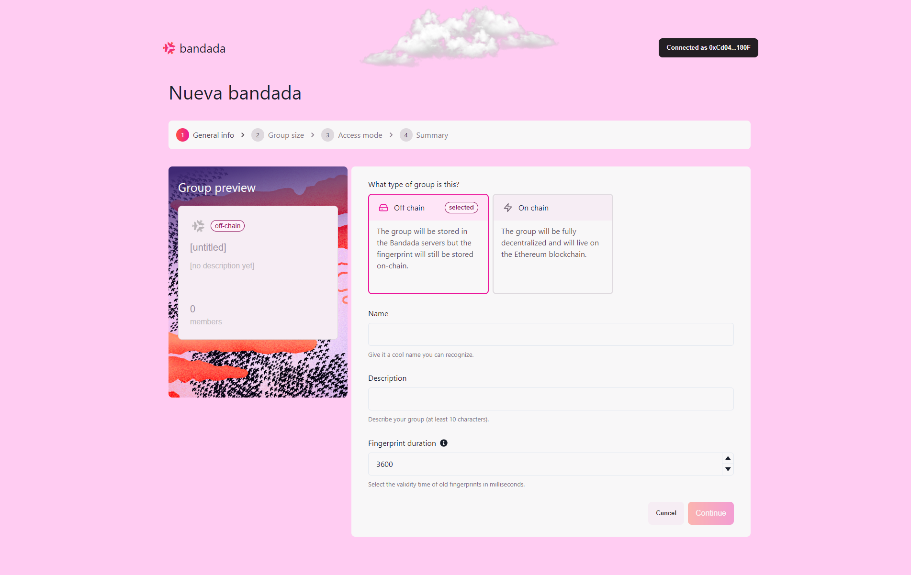
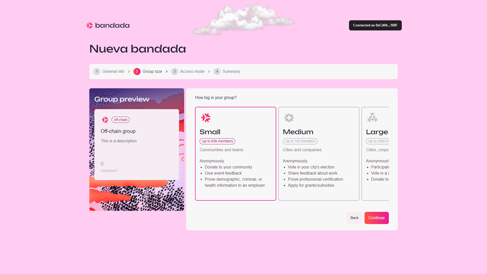
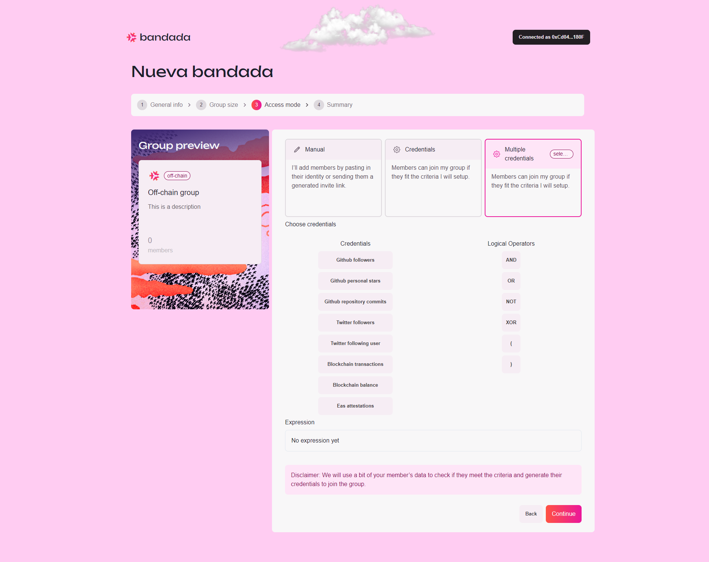
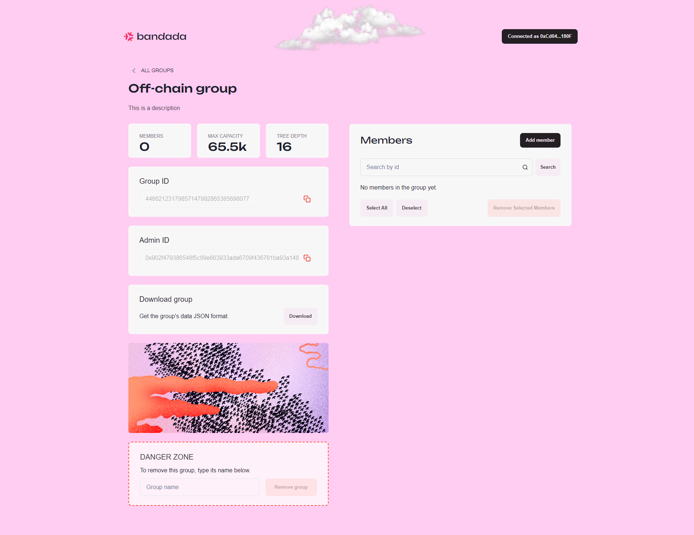
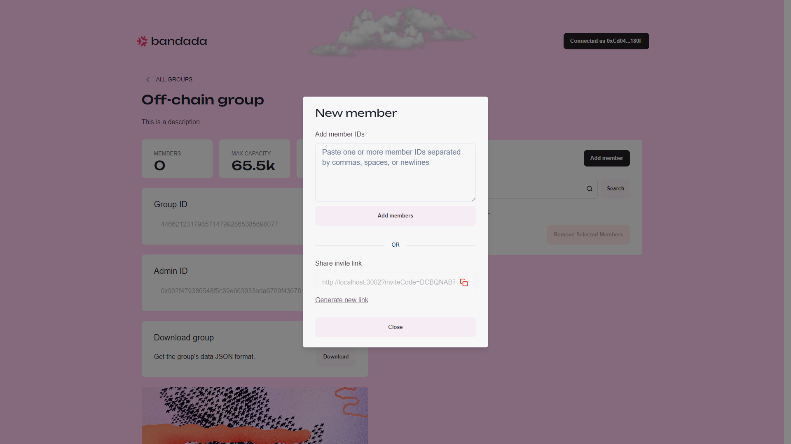
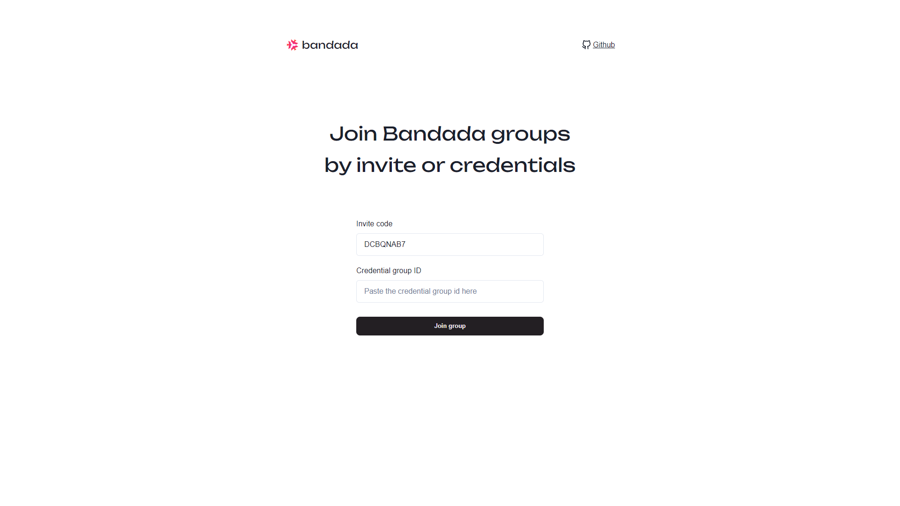
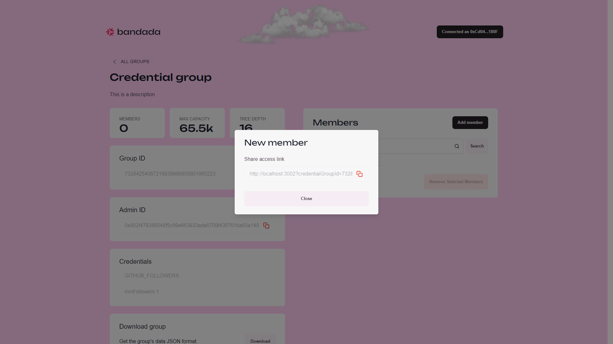
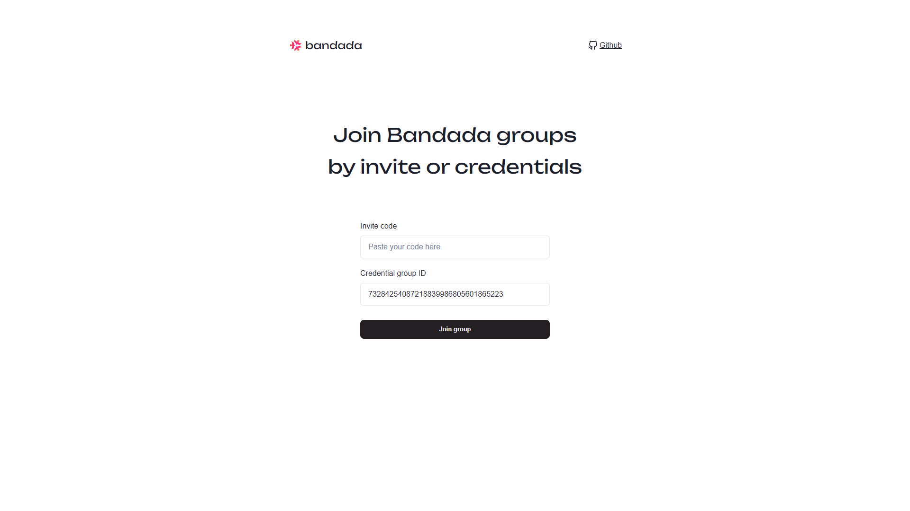
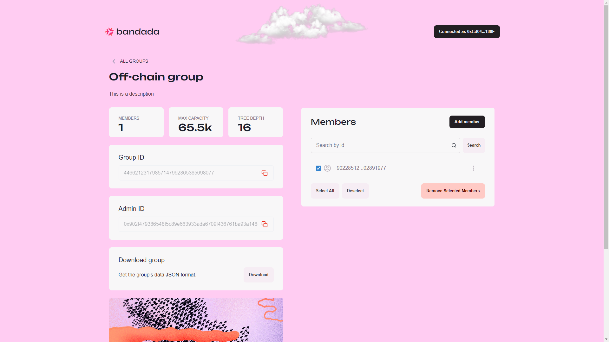

# Tutorial

This tutorial will guide you through the process of creating a group and managing group members using the Bandada Dashboard

## Step 1: Log in to the Bandada Dashboard

1. Open your web browser and navigate to the [Bandada Dashboard](https://app.bandada.pse.dev).
2. Log in by clicking `Sign in with Ethereum` and select the wallet of your choice (MetaMask, Coinbase Wallet, WalletConnect).  
  

## Step 2: Navigating the Groups page

1. Once logged in, you will be greeted by the `Groups` page where you can see a list of your existing groups and other credential groups.
2. On this page, you can:
    - View the details of a group by clicking the group card.
    - Add a new group by clicking the `Add group` button.
    - Search for a specific group by name or description.
    - View, copy, and refresh your API key by clicking the API key button.

## Step 3: Create a new group

1. Click on the `Add group` button.
2. You will be redirected to the `New Group` page.
3. Select the type of group you want to create.

### Create an off-chain group

1. Create an off-chain group by filling in the details:
    - **Name**: Enter the group name.
    - **Description**: Enter the description for the group with at least 10 characters.
    - **Fingerprint Duration**: Select the validity duration of old fingerprints in milliseconds.
2. Click on `Continue` to proceed.  

3. Select the size of the off-chain group from the following options:
    - **Small**: Store up to 65K members.
    - **Medium**: Store up to 1M members.
    - **Large**: Store up to 33M members.
    - **XL**: Store up to 1B members.
4. Click on `Continue` to proceed.  

5. Select the access mode of the off-chain group from the following options:
    - **Manual**: Add members to the group by pasting their identity or sending them a generated invite link.

        

    - **Credentials**: Members can join the group if they fit the criteria you set up.
        - Select credential and provider. Current supported credentials and providers:
            - **Provider**: GitHub.
                - **Credential**: Followers.  
                **Input**: Minimum followers.
                - **Credential**: Personal stars.  
                **Input**: Minimum stars.
                - **Credential**: Repository commits.  
                **Input**: Minimum commits, repository details.
            - **Provider**: Twitter (X).
                - **Credential**: Followers.  
                **Input**: Minimum followers.
                - **Credential**: Following user.  
                **Input**: Username.
            - **Provider**: Blockchain.
                - **Credential**: Transactions.  
                **Input**: Minimum transactions, network, block number.
                - **Credential**: Balance.  
                **Input**: Minimum balance, network, block number.
            - **Provider**: EAS.
                - **Credential**: Attestations.  
                **Input**: Minimum attestations, network, attestation details.
        
        

    - **Multiple Credentials**: Members can join the group if they fit the criteria you set up.
        - Multiple credentials share the same credentials and providers options as single credential, with the additional option of using logical operators like `AND`, `OR`, `NOT`, `XOR`, `(`, and `)` to chain multiple credentials together.
        
        

6. Click on `Continue` to proceed.
7. You will be redirected to the `Group Preview` page to review the group details.
8. Click on `Create Group` to finalize the group creation.

### Create an on-chain group

1. You will be redirected to the `Group Preview` page upon selecting the `On-chain` type in the group type selection.
2. Unlike an off-chain group, you do not have to input any group details to create an on-chain group.
3. Click on `Create Group` to finalize the group creation.

## Step 4: Group management

1. You will be redirected to the `Group Details` page upon successful group creation, or you can access this page by clicking on the group card on the `Groups` page.
2. On this page, you can:
    - View the group details.
    - Copy the group ID.
    - Download the group's data in JSON format.
    - Manage group members.
    - Remove group.

### Add members

1. Click on `Add member` to add member.
2. Depending on the group type, you will be presented with different methods to add members.
    - `Off-chain` groups with `Manual` credential and `On-chain` groups:
        - Add members by pasting one or more member IDs, separated by commas, spaces, and newlines, into the `Add member IDs` field.
        - Click on the `Generate new link` button to generate an invite link. Then, copy the invite link and send it to the person you want to invite.
            - Upon visiting the invite link generated by `Generate new link`, click on `Join group` to join the group.
            - The invite link will be invalidated once the user successfully joins the group.

            
            
            

    - `Off-chain` groups with `Credentials` and `Multiple credentials`:
        - Copy and share the invite link to the person you want to invite.        
            - Upon visiting the invite link, click on `Join group` to join the group.
            - The invite link can be reused even after the user successfully joins the group.
            
            
            
            

### Remove members

Group administrators can remove group members by:
- Check the check box to the left of the member ID, then click on `Remove Selected Members`.
- Click on the option button to the right of the member ID, then click on `Remove`.
            

## Conclusion

You have successfully created a group and managed its members! For more information on how to use Bandada, refer to the [API](https://docs.bandada.pse.dev/api) and [API SDK](https://docs.bandada.pse.dev/api-sdk) documentation.
