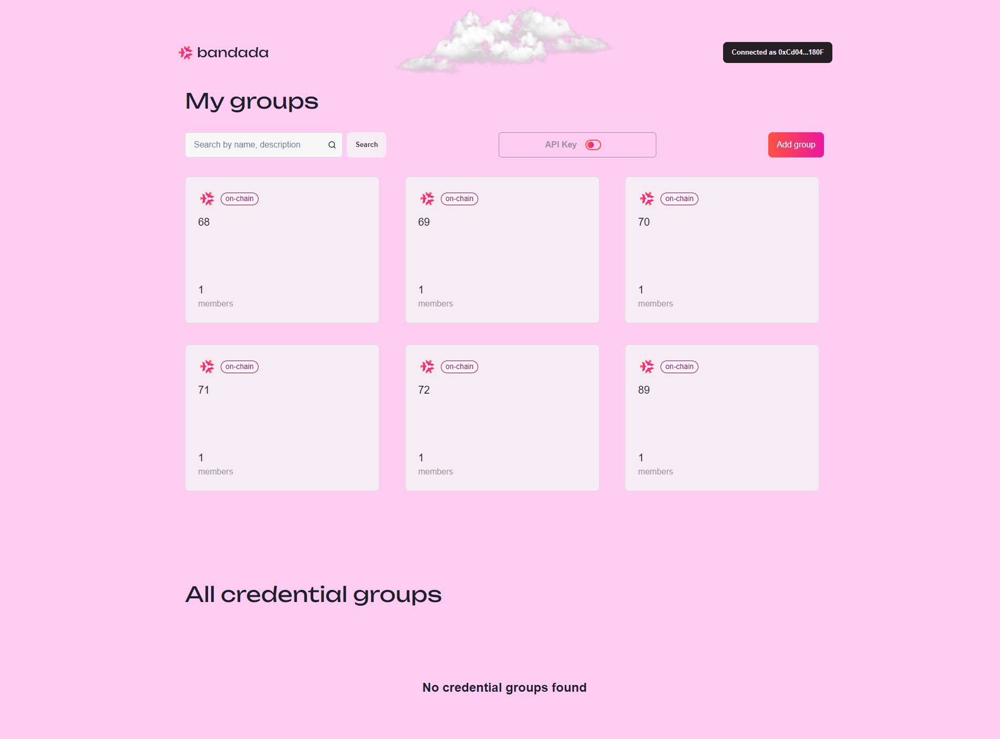

# Login, view, and create groups

## Log in to the Bandada Dashboard

1. Open your web browser and navigate to the [Bandada Dashboard](https://app.bandada.pse.dev).
2. Log in by clicking `Sign in with Ethereum` and select the wallet of your choice (MetaMask, Coinbase Wallet, WalletConnect).  
  

## Navigate the Groups page

1. Once logged in, you will be greeted by the `Groups` page where you can see a list of your existing groups and other credential groups.
2. On this page, you can:
    - View the details of a group by clicking on the group card.
    - Add a new group by clicking the `Add group` button.
    - Search for a specific group by name or description.
    - View, copy, and refresh your API key by clicking on the API key button.

## Create a new group

1. Click on the `Add group` button.
2. You will be redirected to the `New Group` page.
3. Select the type of group you want to create:
    - **Off-chain**: The group will be stored on the Bandada server, but the fingerprint will still be stored on-chain.
    - **On-chain**: The group will be fully decentralized and will be on the Ethereum blockchain.

