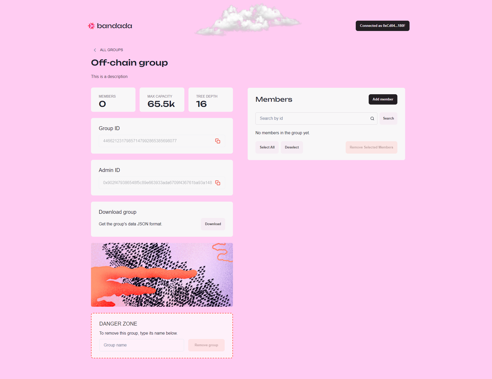
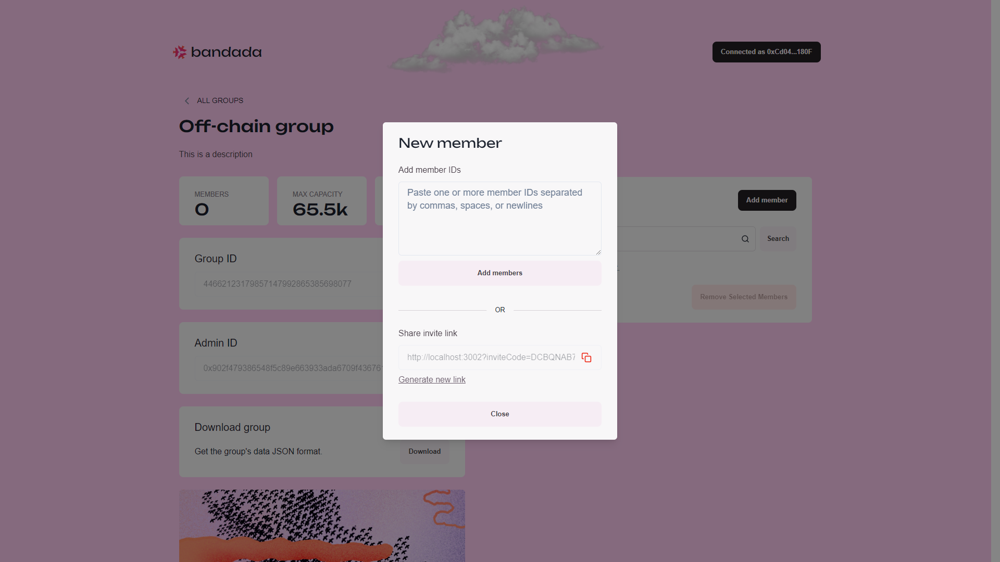
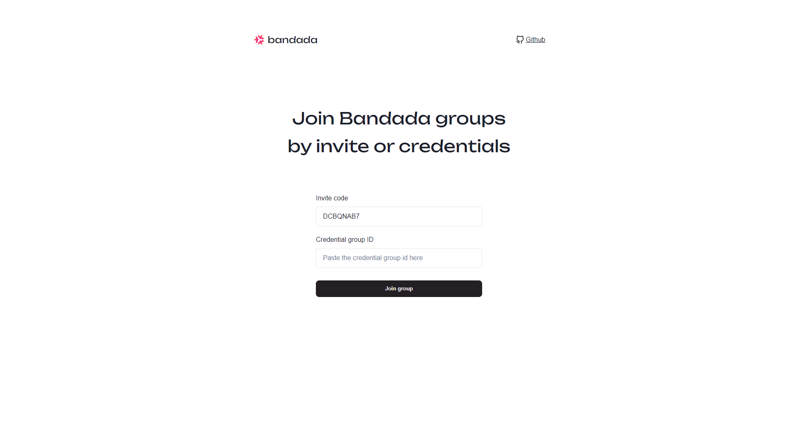
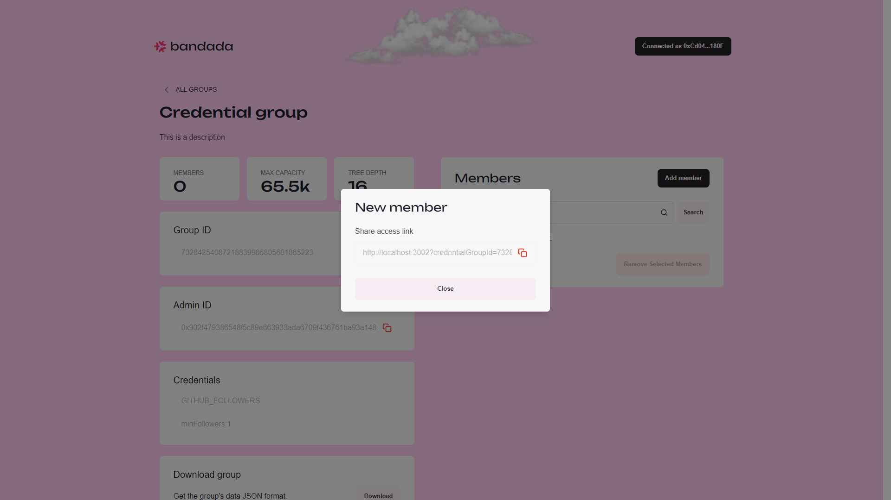
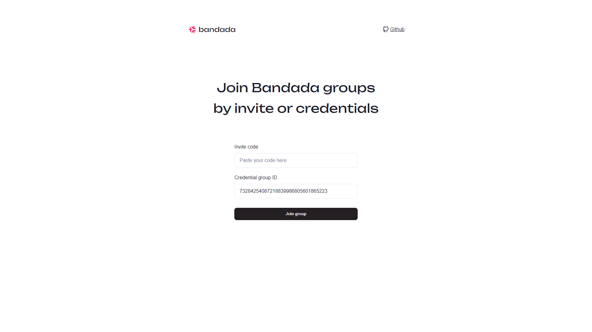
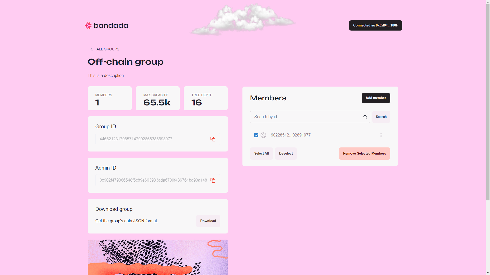
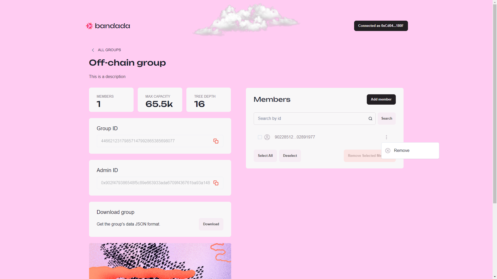

# Manage groups

Upon successful group creation or clicking the group card on the `Groups` page, you will be redirected to the `Group Details` page where you can:
- View the group details.
- Copy the group ID.
- Download the group's data in JSON format.
- Manage group members.
- Remove group.

## Add members

To add members, click on `Add member`.

Depending on the group type, you will be presented with different methods to add members.
- `Off-chain` groups with `Manual` credential and `On-chain` groups:
    - Add members by pasting one or more member IDs, separated by commas, spaces, or newlines, into the `Add member IDs` field.
    - Click on the `Generate new link` button to generate an invite link. Then, copy the invite link and send it with the person you want to invite.
        - Upon visiting the invite link generated by `Generate new link`, click on `Join group` to join the group.
        - The invite link will be invalidated once the user successfully joins the group.

        
        
        

- `Off-chain` groups with `Credentials` and `Multiple credentials`:
    - Copy and share the invite link to the person you want to invite.        
        - Upon visiting the invite link, click on `Join group` to join the group.
        - The invite link can be reused even after the user successfully joins the group.
        
        
        
        

## Remove members

Group administrators can remove group members by:
- Check the checkbox to the left of the member ID, then click on `Remove Selected Members`.

- Click on the option button to the right of the member ID, then click on `Remove`.            

