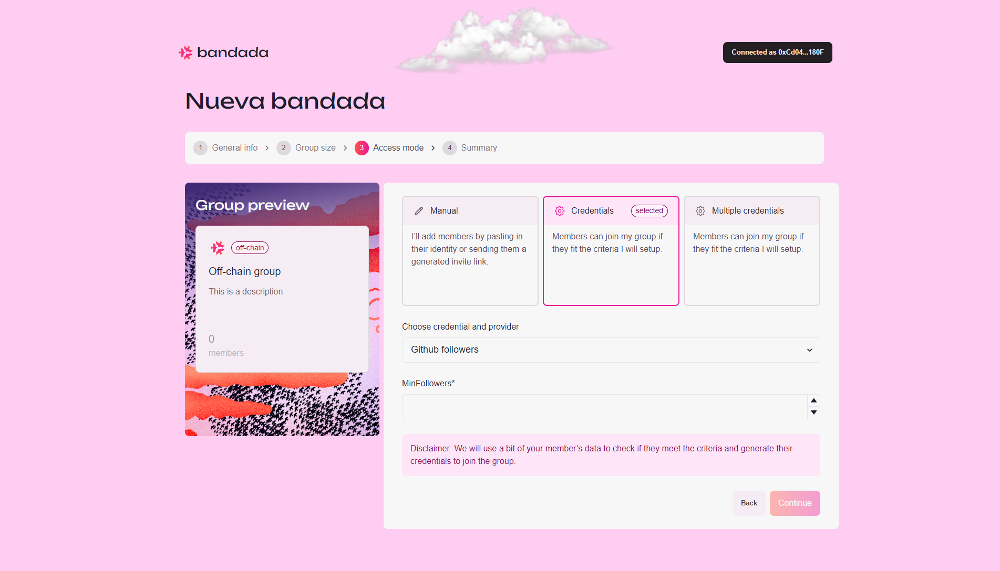

# Credential access

## Create an off-chain group with credential access

1. To create an off-chain group with credential access, select `Credential` access mode.

2. You can select the type of credentials for the off-chain group so that only users that fit the criteria can join the group. Currently supported credentials and providers are:
    - **Provider**: GitHub.
        - **Credential**: Followers.  
        **Input**: Minimum followers.
        - **Credential**: Personal stars.  
        **Input**: Minimum stars.
        - **Credential**: Repository commits.  
        **Input**: Minimum commits, repository details.
    - **Provider**: Twitter (X).
        - **Credential**: Followers.  
        **Input**: Minimum followers.
        - **Credential**: Following user.  
        **Input**: Username.
    - **Provider**: Blockchain.
        - **Credential**: Transactions.  
        **Input**: Minimum transactions, network, block number.
        - **Credential**: Balance.  
        **Input**: Minimum balance, network, block number.
    - **Provider**: EAS.
        - **Credential**: Attestations.  
        **Input**: Minimum attestations, network, and attestation details.  
  
3. Click `Continue` to proceed.
4. You will be redirected to the `Group Preview` page to review the group details.
5. Click `Create Group` to finalize the group creation.

Congratulations! You have successfully created an off-chain credential access group!
