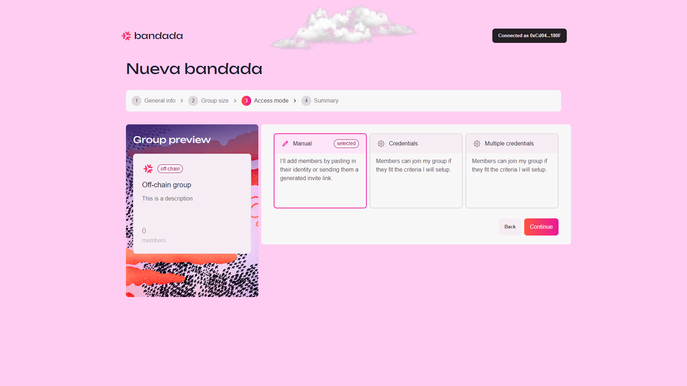

# Manual access

## Create an off-chain group with manual access

1. To create an off-chain group with manual access, select `Manual` access mode.

2. Click `Continue` to proceed.
3. You will be redirected to the `Group Preview` page to review the group details.
4. Click `Create Group` to finalize the group creation.

Congratulations! You have successfully created an off-chain group with manual access!

