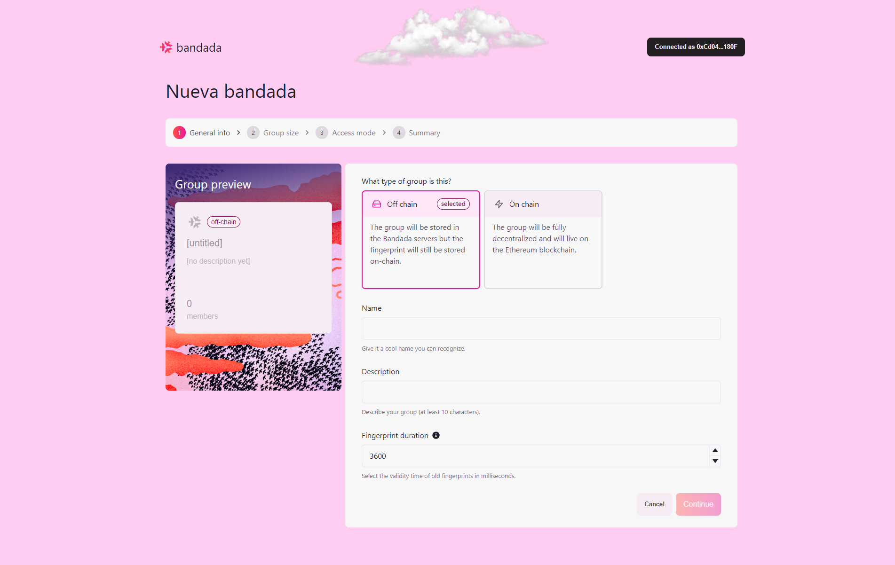
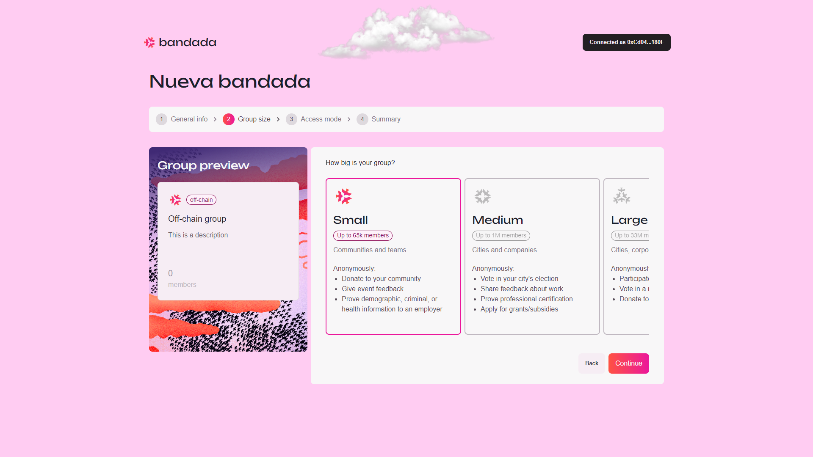

# Off-chain groups

## Create a new off-chain group

1. To create an off-chain group, select the `Off-chain` group type.

2. Fill up the off-chain group details as below:
    - **Name**: Enter the group name.
    - **Description**: Enter the description for the group with at least 10 characters.
    - **Fingerprint Duration**: Select the validity duration of old fingerprints in milliseconds.
3. Click `Continue` to proceed.  

4. Select the size of the off-chain group from the following options:
    - **Small**: Store up to 65K members.
    - **Medium**: Store up to 1M members.
    - **Large**: Store up to 33M members.
    - **XL**: Store up to 1B members.
5. Click `Continue` to proceed.  

